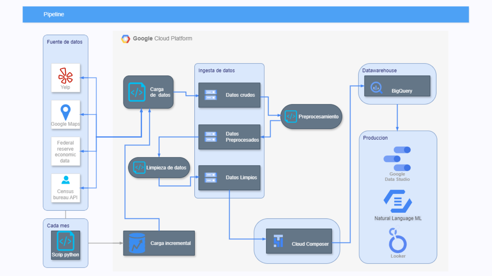

### README - Proceso ETL para Yelp y Google Maps

<div align="right">
  <span><strong>InsightPro Consulting</strong></span>
  
</div>

---

### Tabla de Contenidos
1. [Descripción General](#descripción-general)
2. [Pipeline de Datos](#pipeline-de-datos)
3. [Carga de Datos Crudos (`Carga_de_datos_yelp.py`)](#1-carga-de-datos-crudos-carga_de_datos_yelppy)
4. [Limpieza y Preprocesamiento (`ETL_YELP.py`)](#2-limpieza-y-preprocesamiento-etl_yleppy)
5. [Procesamiento de Datos de Google Maps (`ETL_MAPS.py`)](#3-procesamiento-de-datos-de-google-maps-etl_mapspy)
6. [Modelado Relacional (`ETL_final_modelo_relacional.py`)](#4-modelado-relacional-etl_final_modelo_relacionalpy)
7. [Carga Incremental](#5-carga-incremental)
8. [Herramientas y Librerías Utilizadas](#herramientas-y-librerías-utilizadas)
9. [Conclusión](#conclusión)
10. [Resultados Finales](#resultados-finales)
11. [Pipeline en Producción](#pipeline-en-producción)

---

### Descripción General

Este pipeline ETL ha sido diseñado para procesar y transformar datos provenientes de fuentes como **Yelp**, **Google Maps**, y **datos externos de población e ingresos** en un modelo relacional, listo para análisis en herramientas como **Power BI** y **BigQuery**. Este flujo también incluye soporte para **cargas incrementales mensuales**, garantizando que los datos se mantengan actualizados de manera eficiente.

El pipeline sigue una arquitectura modular, separando las etapas de **recabación**, **preprocesamiento**, y **limpieza** en cuatro scripts secuenciales:

1. `1_Carga_de_datos_yelp.py`: Descarga y convierte datos crudos a formato Parquet.
2. `2_ETL_YELP.py`: Limpieza y transformación inicial de los datos de Yelp.
3. `3_ETL_MAPS.py`: Procesamiento de datos de Google Maps.
4. `4_ETL_final_modelo_relacional.py`: Integración y modelado relacional.

---

### Pipeline de Datos



---

### 1. Carga de Datos Crudos (`Carga_de_datos_yelp.py`)

**Propósito:**
Obtener los datos oficiales desde las fuentes y transformarlos al formato **Parquet**. Este formato fue seleccionado debido a sus ventajas en la manipulación de datos estructurados:

- **Compresión eficiente**: Reduce el tamaño de los archivos.
- **Lectura rápida**: Compatible con herramientas como BigQuery y pandas.
- **Estructura tabular**: Ideal para modelos relacionales.

**Descripción del Proceso:**
- Descarga de datos desde fuentes oficiales como Yelp y Google Maps.
- Conversión de archivos crudos (JSON, CSV) a **Parquet** utilizando pandas y pyarrow.
- Almacenamiento en Google Cloud Storage (GCS).

**Resultado:**
Archivos preprocesados almacenados en GCS, listos para su análisis.

---

### 2. Limpieza y Preprocesamiento (`ETL_YELP.py`)

**Propósito:**
Transformar los datos crudos de Yelp en un conjunto preprocesado, eliminando duplicados, valores nulos y preparando el dataset para su análisis.

**Pasos Clave:**
1. **Carga de datos desde GCS**.
2. **Filtrado y limpieza**:
   - Se eliminaron valores nulos en columnas críticas como `state`, `categories` y `avg_rating`.
   - Eliminación de duplicados por `business_id`.

**Resultado:**
Un archivo Parquet (`meta_df.parquet`) que contiene solo los datos relevantes.

---

### 3. Procesamiento de Datos de Google Maps (`ETL_MAPS.py`)

**Propósito:**
Procesar datos de Google Maps para integrarlos con los datos de Yelp, manteniendo la misma estructura y formato.

**Pasos Clave:**
- Conversión de categorías y atributos en columnas legibles.
- Filtrado por estados y limpieza de valores nulos.
- Generación de un archivo Parquet compatible con el modelo relacional.

**Resultado:**
Datos limpios y listos para análisis.

---

### 4. Modelado Relacional (`ETL_final_modelo_relacional.py`)

**Propósito:**
Integrar los datos limpios y generar un modelo relacional que facilite el análisis en herramientas como Power BI y BigQuery.

**Tablas Generadas:**

1. **Tabla Dimensión LOCALES**:
   - `id_local`, `name`, `id_state`, `category`.
2. **Tabla Dimensión ESTADOS**:
   - `id_state`, `name_state`, `population`, `income`.
3. **Tabla de Hecho REVIEW**:
   - `id_user`, `id_local`, `time`, `text`.

```python
df_locales = df_filtrado.select([
    pl.col("business_id").alias("id_local"),
    pl.col("name").alias("name"),
    pl.col("state").alias("id_state"),
    pl.col("categories").alias("category")
]).unique()
```

4. **Normalización**:
   - Filtrado de estados relevantes ['PA', 'TN', 'FL'] según las necesidades del cliente. 

```python
df_filtrado = df.filter(df['state'].is_in(['PA', 'TN', 'FL']))
```

**Resultado:**
Tres archivos Parquet (`LOCALES.parquet`, `ESTADOS.parquet`, `REVIEW.parquet`) que constituyen el modelo relacional. Listos para ser utilizados en herramientas de análisis como Power BI.

---

### 5. Carga Incremental

#### Proceso

Este pipeline está diseñado para manejar datos nuevos mediante un proceso incremental, ejecutado mensualmente:

1. Identificación de nuevos datos en las fuentes originales.
2. Aplicación de los mismos pasos de limpieza y transformación definidos en los scripts anteriores.
3. Integración de los nuevos datos con los conjuntos existentes en GCS.

#### Ventajas

- **Escalabilidad:** Procesa únicamente datos nuevos.
- **Consistencia:** Garantiza que todos los datos mantengan las mismas reglas de negocio.
- **Automatización:** Integrado con **Cloud Composer** para ejecuciones programadas.

---

### Herramientas y Librerías Utilizadas

1. **Google Cloud Storage (`google-cloud-storage`)**:
   - Para cargar y almacenar datos en la nube.
2. **Polars (`polars`)**:
   - Para manejo eficiente de grandes volúmenes de datos.
3. **PyArrow y pandas**:
   - Conversión de formatos y preprocesamiento de datos.
4. **gcsfs**:
   - Conexión a GCS desde Python.

---

### Conclusión

Este pipeline ETL transforma datos crudos de múltiples fuentes en un modelo relacional optimizado para análisis. La implementación modular y el uso de Parquet garantizan escalabilidad, eficiencia y compatibilidad con herramientas analíticas modernas.

---

### Resultados Finales

1. **Archivos Generados:**
   - `LOCALES.parquet`
   - `ESTADOS.parquet`
   - `REVIEW.parquet`

2. **Ventajas del Proceso:**
   - Datos organizados y listos para análisis.
   - Compatible con cargas incrementales y herramientas como BigQuery y Power BI.

---

### Pipeline en Producción

El pipeline se ejecuta mensualmente, asegurando que los datos más recientes estén siempre disponibles para el cliente y listos para análisis estratégico.